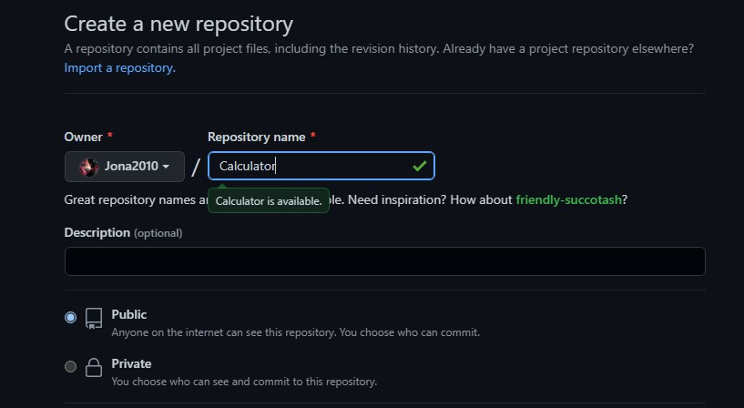
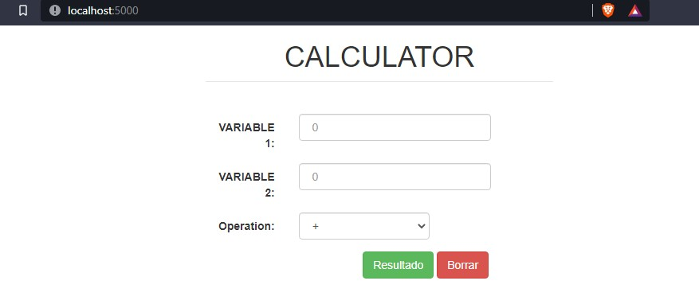
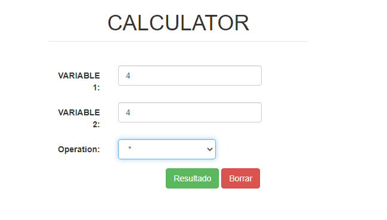
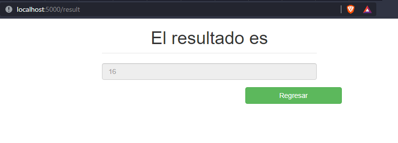

<div align="center">
<table>
    <theader>
        <tr>
            <td></td>
            <th>
                <span style="font-weight:bold;">UNIVERSIDAD LA SALLE</span><br />
                <span style="font-weight:bold;">FACULTAD DE INGENIERÍAS</span><br />
                <span style="font-weight:bold;">DEPARTAMENTO DE INGENIERÍA Y MATEMÁTICAS</span><br />
                <span style="font-weight:bold;">CARRERA PROFESIONAL DE INGENIERÍA DE SOFTWARE</span>
            </th>            
        </tr>
    </theader>
    <tbody>
        <tr><td colspan="2"><span style="font-weight:bold;">Formato</span>: Guía de Práctica de Laboratorio / Talleres / Centros de Simulación</td></tr>        
    </tbody>
</table>
</div>

<div align="center">
<span style="font-weight:bold;">GUÍA DE LABORATORIO</span><br />
</div>

<table>
<theader>
<tr><th colspan="2">INFORMACIÓN BÁSICA</th></tr>
</theader>
<tbody>

<tr><td>TÍTULO DE LA PRÁCTICA:</td><td>Calculadora</td></tr>
<tr><td colspan="2">RECURSOS A UTILIZAR:
<ul>
<li><a href="https://guides.github.com/">https://guides.github.com/</a></li>
<li><a href="https://git-scm.com/book/es/v2">https://git-scm.com/book/es/v2</a></li>
</ul>
</td>
</<tr>
<tr><td colspan="2">DOCENTES:
<ul>
<li>Richart Smith Escobedo Quispe (r.escobedo@ulasalle.edu.pe)</li>
</ul>
</td>
</<tr>
</tdbody>
</table>


# OBJETIVOS TEMAS Y COMPETENCIAS

## OBJETIVOS

- Aprender a manejar un sistema de control de versiones de manera colaborativa con varios
usuarios

## TEMAS
- Git
- GitHub

# CONTENIDO DE LA GUÍA

## MARCO CONCEPTUAL

- Instalar Git en el ordenador

	- MS Windows
		- Descargar Git-2.36.0-64-bit.exe desde https://git-scm.com/download/win


## EJERCICIO RESUELTO
Primer repositorio en GitHub
- Creamos un nuevo proyecto en GitHub
    - 

- Crearemos un repositorio local usando git init
    ```sh
    D:\La Salle\Ingeniera Web 2022\Calculadora
    git init
    ```

- Crearemos un archivo Readme.md
    ```sh
    echo "# Calculadora" > README.md
    ```
- Luego lo añadiremos a nuestro GitHub
    ```sh
    git add README.md
    ```

- Hacemos un primer commit en nuestro repositorio local 
    ```sh
    git commit -m "Mi primer proyecto en github"
    ```
- Asociamos el repositorio local con el repositorio remoto 
    ```sh
    git remote add origin https://github.com/Jona2010/Calculadora.git
    ```

- Actualizamos el repositorio remoto
    ```sh
    git push -u origin main
    ```

- Creamos un archivo Python calculadora.py que establezca una conexión con Flask para ejecutarlo en nuestro navegador web, también creamos dos archivos HTML que serían la calculadora.html y resultado.htmly subimos todo al repositorio GitHub.
    ```
    python calculadora.py
    ```
<pre>   
from flask import Flask,render_template, request
from flask_mysqldb import MySQL

app = Flask(__name__,template_folder="template")

@app.route('/')
def index():
    return render_template('calculadora.html')

@app.route('/result', methods=['POST'])
def result():
    var_1 = request.form.get("var_1", type=int)
    var_2 = request.form.get("var_2", type=int)
    operation = request.form.get("operation")
    if(operation == '+'):
        result = var_1 + var_2
    elif(operation == '-'):
        result = var_1 - var_2
    if(operation == '+'):
        result = var_1 + var_2
    elif(operation == '-'):
        result = var_1 - var_2
    elif(operation == '*'):
        result = var_1 * var_2
    elif(operation == '/'):
        result = var_1 / var_2
    elif(operation == '%'):
        result = var_1 % var_2
    else:
        result = 'operacion invalida'
    entry = result
    return render_template('resultado.html', entry=entry)

if __name__ == '__main__':
    app.run(host='localhost', port=5000)
    </pre>
    
 - Vemos la versión de Python
    ``    
    python --version
    ```
    <pre>
    Python 3.9.7
    </pre>
    ```sh
    python calculadora.py
    ```
    
    ```
    git add python calculadora.py
    git commit -m "Calculadora usando python y HTML"
    git push -u origin Jonathan
    ```
    
- Resultado de nuestro código
    - 
    - 
    - 
    
    
## CUESTIONARIO
- ¿Por qué Git es una herramienta importante en el curso?
   
   Primeramente, git es un software libre que no depende de un repositorio central por lo cual se ha convertido en una herramienta para el curso, debido a que nos deja    controlar los cambios que hacemos en el código como en nuestra aplicación; es decir, podemos ver todo un historial con todos cambios que hemos hecho durante el        proceso.
- ¿Qué conductas éticas debe promocionarse cuando se usa un Sistema de Control de Versiones?


- ¿Qué son los entándares de codificación?
  Estándar de codificación o Code Standard en inglés, son parte de las llamadas buenas prácticas o mejores prácticas, son un conjunto no formal de reglas que han ido surgiendo en las distintas comunidades de desarrolladores con el paso del tiempo y las cuales han sido aplicadas para poder incrementar la calidad de tu código.

## REFERENCIAS Y BIBLIOGRÁFIA RECOMENDADAS
- https://guides.github.com/
- https://git-scm.com/book/es/v2


